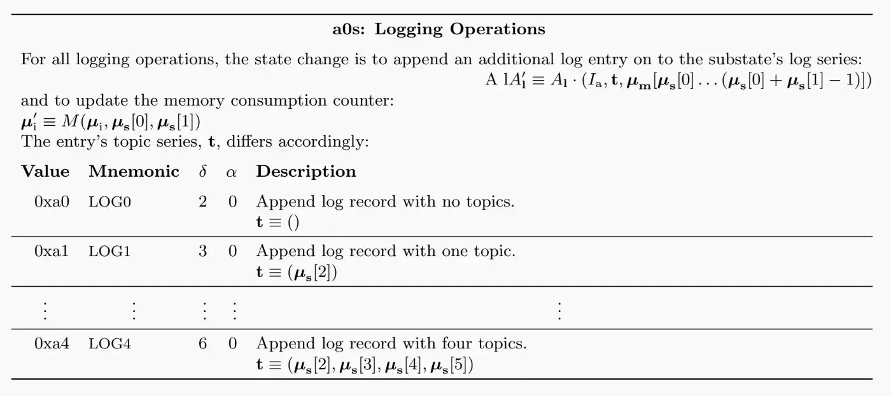
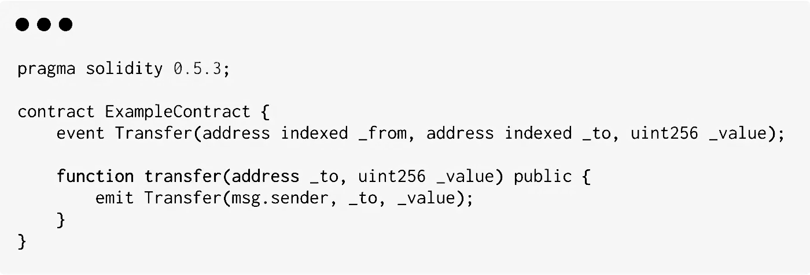
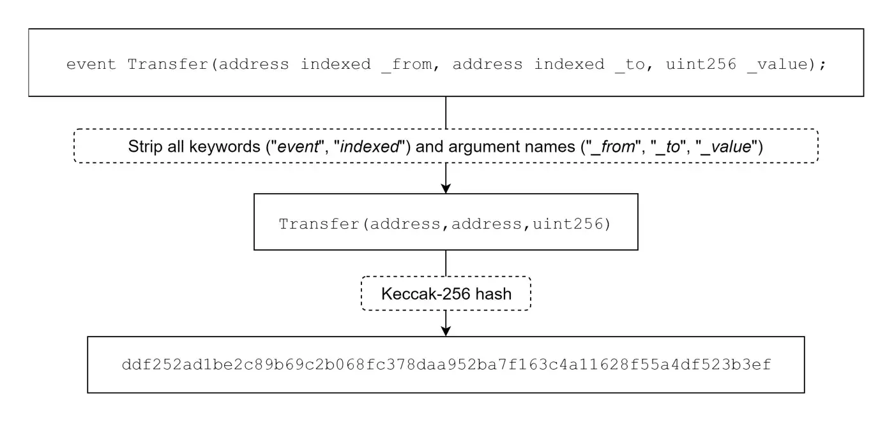
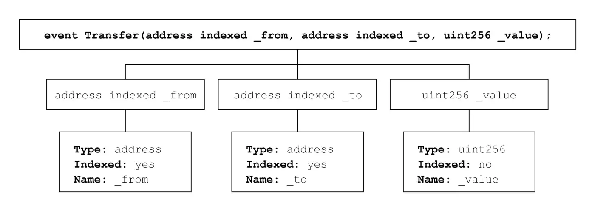
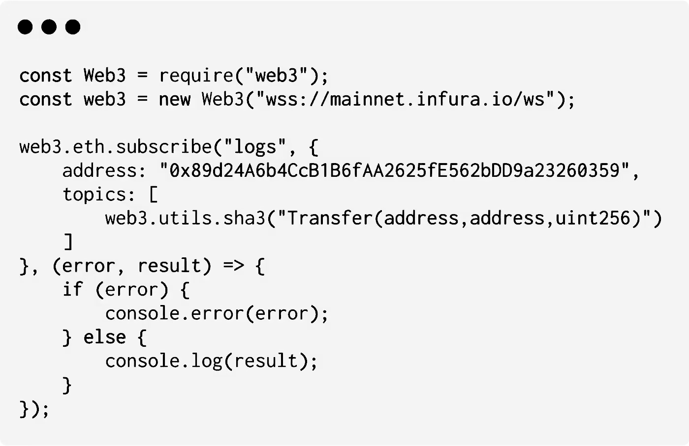
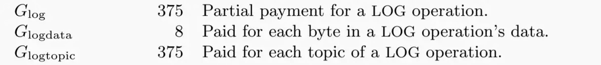
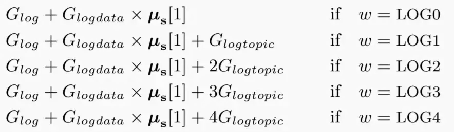

Most transactions have an event log, but those event logs can be hard to read.

## Logging in Ethereum
The EVM currently has 5 opcodes for emitting event logs: LOG0, LOG1, LOG2, LOG3, and LOG4.

These opcodes can be used to create log records. A log record can be used to describe an event within a smart contract, like a token transfer or a change of ownership.


{height=240}

Each log record consists of both topics and data. Topics are 32-byte (256 bit) “words” that are used to describe what’s going on in an event. Different opcodes (`LOG0 … LOG4`) are needed to describe the number of topics that need to be included in the log record. For instance, `LOG1` includes one topic, while `LOG4` includes four topics. Therefore, the maximum number of topics that can be included in a single log record is four.

### Topics in Ethereum Log Records
The first part of a log record consists of an array of topics. These topics are used to describe the event. The first topic usually consists of the signature (a keccak256 hash) of the name of the event that occurred, including the types (`uint256`, `string`, etc.) of its parameters. One exception where this signature is not included as the first topic is when emitting anonymous events. Since topics can only hold a maximum of 32 bytes of data, things like arrays or strings cannot be used as topics reliably. Instead, it should be included as data in the log record, not as a topic. If you were to try including a topic that’s larger than 32 bytes, the topic will be hashed instead. As a result, this hash can only be reversed if you know the original input.  In conclusion, topics can be seen as indexed keys of the event that all map to the same value and only reliably be used for data that strongly narrows down search queries (like addresses).

### Data in Ethereum Log Records
The second part of a log record consists of additional data. Topics and data work best together as there are upsides and downsides to each. For example, while topics are searchable, data is not. But, including data is a lot cheaper than including topics. Additionally, while topics are limited to 4 * 32 bytes, event data is not, which means it can include large or complicated data like arrays or strings. Therefore, the event data (if any) can be seen as the value.

Let’s take a look at some examples to see how topics, data, and log records are used in the wild.

### Emitting events
The following contract implements the Transfer event, used by ERC20-compliant token contracts:

{height=160}

Since this is not an anonymous event, the first topic will consist of the event signature:

{height=320}

\pagebreak

Now, let’s take a look at the arguments (from, to, value) of this Solidity event:

{height=240}


Since the first 2 arguments are declared as indexed, they are treated like additional topics. Our final argument will not be indexed, which means it will be attached as data (instead of a separate topic). This means we are able to search for things like “find all Transfer logs from address 0x0000… to address 0x0000…” or even “find all logs to address 0x0000…”, but not for things like “find all Transfer logs with value x”. We know this event will have 3 topics, which means this logging operation will use the `LOG3` opcode.

{height=240}

Now, we just need to understand how data (like our final argument) can be included. `LOG3` requires 5 arguments:

```
LOG3(memoryStart, memoryLength, topic1, topic2, topic3)
```

Event data is read from memory in the following fashion:

```
memory[memoryStart...(memoryStart + memoryLength)]
```

Luckily, higher-level smart contract programming languages like Solidity, Vyper, or Bamboo will handle writing event data to memory for us, which means you can usually pass data directly as a parameter when emitting logs.

### Retrieving event logs
Using web3, a popular JavaScript library used to interact with a local or remote Ethereum node, we are able to subscribe to new event logs:

{height=240}

This code will alert us whenever a new SAI token transfer has occurred, which can be useful for various applications. For example, a wallet interface could alert you whenever you receive tokens on your Ethereum address.

## Cost of logging operations

{height=40}

The base cost of logging operations is 375 gas. On top of that, every included topic costs an additional 375 gas. Finally, each byte of data costs 8 gas.

{height=120}


That’s actually pretty cheap! Let’s imagine an ERC-20 token transfer. First, we have a base cost of 375 gas. Second, the Transfer event contains 3 topics, which is an additional 375 * 3 = 1125 gas. Finally, we add 8 gas for each byte of data included. Since the data only contains the value of the ERC-20 transfer, which can be a maximum of 32 bytes ($2^256$), the maximum amount of gas needed to account for the data of the logging operation would be 8 * 32 = 256 gas. This adds up to a total gas cost of 1756 gas. For reference, a standard ether (non-token) transfer costs 21000 gas, or more than 10x that!

If we assume a gas price of 1 gwei, the total cost of the operation would be 1756 gwei, the equivalent of 0.000001756 ETH. If the current price of ETH is around $200, this would only add up to $.0003512. Keep in mind that this is the price of storing data on the blockchain worldwide, likely forever.

### Disclaimer
This is just the cost of a logging operation itself. Any Ethereum transaction starts at 21000 gas, and the transaction’s input data costs up to 16 gas per byte. Typically, to transfer & log an ERC-20 token, it costs between 40,000–60,000 gas.

## Conclusion
Logs are an elegant way to store tiny amounts of data on the Ethereum blockchain for a small price. Specifically, event logs are useful to let other people know something has happened without them having to query contracts individually.
