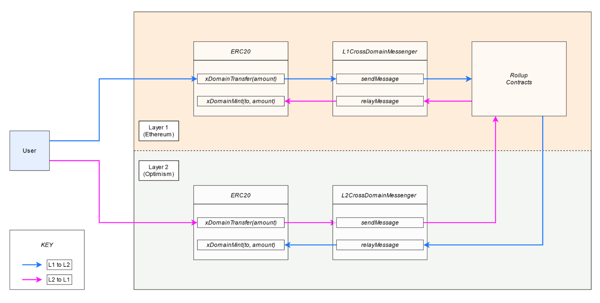

# How does Optimism's rollup really work?

Author: Georgios Konstantopoulos, on Jan 29, 2021

https://research.paradigm.xyz/optimism

# Abstract
Optimism provides a throughput increasing solution for Ethereum, while maintaining full compatibility with existing tooling and re-using well tested and optimized software written by the Ethereum community. We are beyond excited for the future of Ethereum and the new use cases and companies that will be uniquely enabled by Optimism’s scalable infrastructure.

# Table of Contents
- Reusing Ethereum
    * The Optimism VM
    * Solidity
    * go-ethereum
- Optimism Rollup
    * Data Availability Batches
    * State Commitments
    * Fraud Proofs
    * Incentives & Bonds
    * Nuisance Gas
- Appendix
    * OVM Opcodes
    * L1-L2 Interoperability
    * Account Abstraction

\pagebreak

# Reusing Ethereum
Ethereum has developed a moat around its developer ecosystem. The developer stack is comprised of:

- Solidity / Vyper: The 2 main smart contract programming languages which have large toolchains (e.g. Ethers, Hardhat, dapp, slither.)

- Ethereum VM: The most popular blockchain virtual machine to date, the internals of which are understood much better than any alternative blockchain VM.

- go-ethereum: The dominant Ethereum protocol implementation which makes up for more than 75% of the network’s nodes. It is extensively tested.


Software reuse, not only for compatibility, but also security. Auditing then becomes a simple matter of inspecting the difference from the original, instead of re-inspecting a codebase that’s potentially 100k+ lines of code. As a result, Optimism has created “optimistic” variants of each piece of the stack.

## The Optimism VM
Optimistic rollups rely on using fraud proofs to prevent invalid state transitions from happening. This requires executing an Optimism transaction on Ethereum. However, certain EVM opcodes would not behave the same on L1 and L2 if they rely on system-wide parameters which change all the time such as loading or storing state, or getting the current timestamp. As a result, the first step towards resolving a dispute about L2 on L1 is a mechanism which guarantees that it’s possible to reproduce any “context” that existed at the time the L2 transaction was executed on L1 (ideally without too much overhead).

#### Goal:
A sandboxed environment which guarantees deterministic smart contract execution between L1 and L2.

#### Solution:
The Optimism VM (OVM) is implemented by replacing context-dependent EVM opcodes with their OVM counterparts.

#### Example:
- A L2 transaction calls the `TIMESTAMP` opcode, returning e.g. 1610889676
- An hour later, the transaction (for any reason) has to be replayed on Ethereum L1 during a dispute.
- If that transaction were to be executed normally in the EVM, the TIMESTAMP opcode would return 1610889676 + 3600. We don’t want that!
- In the OVM, the TIMESTAMP opcode is replaced with `OVMTIMESTAMP` which would show the correct value, at the time the transaction was executed on L2.
- All context-dependent EVM opcodes have an `OVM{OPCODE}` counterpart in the core OVM smart contract, the ExecutionManager. Contract execution starts via the ExecutionManager’s main entrypoint, the run function. These opcodes are also modified to have a pluggable state database to interact with, for reasons we’ll dive into in the Fraud Proofs section.

Certain opcodes which do not “make sense” in the OVM are disallowed via Optimism SafetyChecker, a smart contract which effectively acts as a static analyzer returning 1 or 0, depending on if the contract is “OVM-safe”. We refer you to the appendix for a complete explanation of each modified/banned opcode.


\pagebreak

## Solidity
Now that we have our sandbox, the OVM, we need to make our smart contracts compile to OVM bytecode. Here are some of our options:

- Create a new smart contract language that compiles down to OVM: A new smart contract language is an easy to dismiss idea since it requires re-doing everything from scratch, and we’ve already agreed we don’t do that here.
- Transpile EVM bytecode to OVM bytecode: was tried but abandoned due to complexity.
- Support Solidity and Vyper by modifying their compilers to produce OVM bytecode.

The currently used approach is the 3rd. Optimism forked solc and changed ~500 lines. The Solidity compiler works by converting the Solidity to Yul then into EVM Instructions and finally into bytecode. The change made by Optimism is simple yet elegant: For each opcode, after compiling to EVM assembly, try to “rewrite” it in its OVM variant if needed (or throw an error if it’s banned).

Let’s use an example by comparing the EVM and OVM bytecodes of this simple contract:

```
pragma solidity ^0.6.12;

contract C {
   uint x;

   function foo() public {
      x += 1;
   }
}
```

```
$ solc C.sol --bin-runtime --optimize --optimize-runs 200
6080604052348015600f57600080fd5b506004361060285760003560e...
```

We can disassemble this code and dive into the opcodes2 to see what’s going on:

```
[025] 35 CALLDATALOAD

[030] 63 PUSH4 0xc2985578 // id("foo()")
[035] 14 EQ
[036] 60 PUSH1 0x2d // int: 45
[038] 57 JUMPI // jump to PC 45

[045] 60 PUSH1 0x33
[047] 60 PUSH1 0x35 // int: 53
[049] 56 JUMP // jump  to PC 53

[053] 60 PUSH1 0x00
[055] 80 DUP1
[056] 54 SLOAD // load the 0th storage slot
[057] 60 PUSH1 0x01
[059] 01 ADD // add 1 to it
[060] 90 SWAP1
[061] 55 SSTORE // store it back
[062] 56 JUMP
```

What this assembly says is that if there’s a match between the calldata and the function selector of foo() [3], then `SLOAD` the storage variable at 0x00, add 0x01 to it and `SSTORE` it back.

#### How does this look in OVM?
```
$ osolc C.sol --bin-runtime --optimize --optimize-runs 200
60806040523480156100195760008061001661006e565b50505b506004...
```

This is much bigger, let’s disassemble it:

```
[036] 35 CALLDATALOAD

[041] 63 PUSH4 0xc2985578 // id("foo()")
[046] 14 EQ
[047] 61 PUSH2 0x0042
[050] 57 JUMPI // jump to PC 66

[066] 61 PUSH2 0x004a
[069] 61 PUSH2 0x004c // int: 76
[072] 56 JUMP // jump to PC 76
```

Matching the function selector is the same with before, what happens afterwards:

```
[076] 60 PUSH1 0x01 // Push 1 to the stack (to be used for the addition later)
[078] 60 PUSH1 0x00
[080] 80 DUP1
[081] 82 DUP3
[082] 82 DUP3
[083] 61 PUSH2 0x005b
[086] 61 PUSH2 0x00d9 (int: 217)
[089] 56 JUMP // jump to PC 217

[217] 63 PUSH4 0x03daa959       // <---|  id("OVMSLOAD(bytes32)")
[222] 59 MSIZE                  //     |                                       
[223] 81 DUP2                   //     |                                       
[224] 60 PUSH1 0xe0             //     |                                       
[226] 1b SHL                    //     |                                       
[227] 81 DUP2                   //     |                                       
[228] 52 MSTORE                 //     |                                       
[229] 83 DUP4                   //     |                                       
[230] 60 PUSH1 0x04             //     | CALL to the CALLER's OVMSLOAD
[232] 82 DUP3                   //     |                                       
[233] 01 ADD                    //     |                                       
[234] 52 MSTORE                 //     |                                       
[235] 60 PUSH1 0x20             //     |                                       
[237] 81 DUP2                   //     |  
[238] 60 PUSH1 0x24             //     |                                     
[240] 83 DUP4                   //     |                                       
[241] 33 CALLER                 //     |                                       
[242] 60 PUSH1 0x00             //     |                                       
[244] 90 SWAP1                  //     |                                       
[245] 5a GAS                    //     |                                       
[246] f1 CALL                   // <---|

[247] 58 PC                     // <---|  
[248] 60 PUSH1 0x1d             //     |                                       
[250] 01 ADD                    //     |                                       
[251] 57 JUMPI                  //     |                                       
[252] 3d RETURNDATASIZE         //     |                                       
[253] 60 PUSH1 0x01             //     |                                       
[255] 14 EQ                     //     |                                       
[256] 58 PC                     //     |                                       
[257] 60 PUSH1 0x0c             //     |                                       
[259] 01 ADD                    //     |                                       
[260] 57 JUMPI                  //     |  Handle the returned data             
[261] 3d RETURNDATASIZE         //     |                                       
[262] 60 PUSH1 0x00             //     |                                       
[264] 80 DUP1                   //     |                                       
[265] 3e RETURNDATACOPY         //     |                                       
[266] 3d RETURNDATASIZE         //     |                                       
[267] 62 PUSH3 0x123456         //     |                                       
[271] 52 MSTORE                 //     |                                       
[272] 60 PUSH1 0xea             //     |                                       
[274] 61 PUSH2 0x109c           //     |                                       
[277] 52 MSTORE                 // <---|                                                            
```

There’s a lot going on here. The gist of it however is that instead of doing an `SLOAD`, the bytecode builds up the stack to make a `CALL`. The receiver of the call is pushed to the stack via the `CALLER` opcode. Every call comes from the ExecutionManager, so in practice, `CALLER` is an efficient way to call the ExecutionManager. The data of the call starts with the selector for `OVMSLOAD(bytes32)`, followed by its arguments (in this case, just a 32 bytes word). After that, the returned data is handled and added into memory.

Moving on:
```
[297] 82 DUP3
[298] 01 ADD // Adds the 3rd item on the stack to the OVMSLOAD value
[299] 52 MSTORE
[308] 63 PUSH4 0x22bd64c0  // <---| id("OVMSSTORE(bytes32,bytes32)")
[313] 59 MSIZE             //     |                                                           
[314] 81 DUP2              //     |                                                            
[315] 60 PUSH1 0xe0        //     |                                                                  
[317] 1b SHL               //     |                                                           
[318] 81 DUP2              //     |                                                            
[319] 52 MSTORE            //     |                                                              
[320] 83 DUP4              //     |                                                            
[321] 60 PUSH1 0x04        //     |                                                                  
[323] 82 DUP3              //     |                                                            
[324] 01 ADD               //     |  CALL to the CALLER's OVMSSTORE
[325] 52 MSTORE            //     |  (RETURNDATA handling is omited
[326] 84 DUP5              //     |   because it is identical to OVMSSLOAD)
[327] 60 PUSH1 0x24        //     |                                                                  
[329] 82 DUP3              //     |                                                            
[330] 01 ADD               //     |                                                           
[331] 52 MSTORE            //     |                                                              
[332] 60 PUSH1 0x00        //     |                                                                  
[334] 81 DUP2              //     |                                                            
[335] 60 PUSH1 0x44        //     |                                                                  
[337] 83 DUP4              //     |                                                            
[338] 33 CALLER            //     |                                                              
[339] 60 PUSH1 0x00        //     |                                                                  
[341] 90 SWAP1             //     |                                                             
[342] 5a GAS               //     |                                                           
[343] f1 CALL              // <---|                                                            
```

Similarly to how `SLOAD` was rewired to an external call to `OVMSLOAD`, `SSTORE` is rewired to make an external call to `OVMSSTORE`. The call’s data is different because `OVMSSTORE` requires 2 arguments, the storage slot and the value being stored. Here’s a side by side comparison:

```
OVMSLOAD	OVMSSTORE
   [217] 63 PUSH4 0x03daa959
   [222] 59 MSIZE           
   [223] 81 DUP2            
   [224] 60 PUSH1 0xe0      
   [226] 1b SHL             
   [227] 81 DUP2            
   [228] 52 MSTORE          
   [229] 83 DUP4            
   [230] 60 PUSH1 0x04      
   [232] 82 DUP3            
   [233] 01 ADD             
   [234] 52 MSTORE          
   [235] 60 PUSH1 0x20      
   [237] 81 DUP2            
   [238] 60 PUSH1 0x24      
   [240] 83 DUP4            
   [241] 33 CALLER          
   [242] 60 PUSH1 0x00      
   [244] 90 SWAP1           
   [245] 5a GAS             
   [246] f1 CALL            
   
   [308] 63 PUSH4 0x22bd64c0
   [313] 59 MSIZE           
   [314] 81 DUP2            
   [315] 60 PUSH1 0xe0      
   [317] 1b SHL             
   [318] 81 DUP2            
   [319] 52 MSTORE          
   [320] 83 DUP4            
   [321] 60 PUSH1 0x04      
   [323] 82 DUP3            
   [324] 01 ADD             
   [325] 52 MSTORE          
   [326] 84 DUP5            
   [327] 60 PUSH1 0x24      
   [329] 82 DUP3            
   [330] 01 ADD             
   [331] 52 MSTORE          
   [332] 60 PUSH1 0x00      
   [334] 81 DUP2            
   [335] 60 PUSH1 0x44      
   [337] 83 DUP4            
   [338] 33 CALLER          
   [339] 60 PUSH1 0x00      
   [341] 90 SWAP1           
   [342] 5a GAS             
   [343] f1 CALL            
```
   
Effectively, instead of making an `SLOAD` and then a `SSTORE`, we’re making a call to the _Execution Manager_’s `OVMSLOAD` and then its `OVMSSTORE` methods. Comparing the EVM vs OVM execution (we only show the `SLOAD` part of the execution), we can see the virtualization happening via the _Execution Manager_.


\pagebreak

There’s a “gotcha” of this virtualization technique: The contract size limit gets hit faster: Normally, Ethereum contracts can be up to 24KB in bytecode size [5]. A contract compiled with the Optimism Solidity Compiler ends up bigger than it was, meaning that contracts near the 24KB limit must be refactored so that their OVM size still fits in the 24KB limit since they need to be executable on Ethereum mainnet (e.g. by making external calls to libraries instead of inlining the library bytecode.) The contract size limit remains the same as OVM contracts must be deployable on Ethereum.

## go-ethereum
The most popular implementation of Ethereum is go-ethereum (aka geth). On each block, the state processor’s Process is called which calls ApplyTransaction on each transaction. Internally, transactions are converted to messages [6], messages get applied on the current state, and the newly produced state is finally stored back in the database. This core data flow remains the same on Optimism go-ethereum, with some modifications to make transactions “OVM friendly”.

### Modification 1: OVM Messages via the Sequencer Entrypoint
Transactions get converted to OVM Messages. Since messages are stripped of their signature, the message data is modded to include the transaction signature (along with the rest of the original transaction’s fields). The to field gets replaced with the “sequencer entrypoint” contract’s address. This is done in order to have a compact transaction format, since it will be published to Ethereum, and we’ve established that the better our compression, the better our scaling benefits.

### Modification 2: OVM sandboxing via the _Execution Manager_
In order to run transactions through the OVM sandbox, they _must_ be sent to the _Execution Manager_’s run function. Instead of requiring that users submit only transactions which match that restriction, all messages are modded to be sent to the _Execution Manager_ internally. What happens here is simple: The message’s to field is replaced by the _Execution Manager_’s address, and the message’s original data is packed as arguments to run. See https://github.com/gakonst/optimism-tx-format.

### Modification 3: Intercept calls to the _State Manager_
The _State Manager_ is a special contract which doesn’t exist on Optimism go-ethereum. It only gets deployed during fraud proofs. The careful reader will notice that when the arguments are packed to make the run call, Optimism go-ethereum also packs a hardcoded _State Manager_ address. That’s what ends up getting used as the final destination of any `OVMSSTORE` or `OVMSLOAD` (or similar) calls. When running on L2, any messages targeting the _State Manager_ contract get intercepted, and they are wired to directly talk to go-ethereum’s StateDB (or do nothing). To people looking for overall code changes, the best way to do this is by searching for UsingOVM and by comparing the diff from geth 1.9.10.

### Modification 4: Epoch-based batches instead of blocks
The OVM does not have blocks, it just maintains an ordered list of transactions. Because of this, there is no notion of a block gas limit; instead, the overall gas consumption is rate limited based on time segments, called epochs [8]. Before a transaction is executed, there’s a check to see if a new epoch needs to be started, and after execution its gas consumption is added on the cumulative gas used for that epoch. There is a separate gas limit per epoch for sequencer submitted transactions and “L1 to L2” transactions. Any transactions exceeding the gas limit for an epoch return early. This implies that an operator can post several transactions with varying timestamps in one on-chain batch (timestamps are defined by the sequencer, with some restrictions which we explain in the “Data Availability Batches” section).

### Modification 5: Rollup Sync Service
The sync service is a new process that runs alongside “normal” geth operations. It is responsible for monitoring Ethereum logs, processing them, and injecting the corresponding L2 transactions to be applied in the L2 state via geth’s worker.

\pagebreak

# The Optimism Rollup
The Optimism rollup is a rollup using the OVM as its runtime and state transition function, Optimism go-ethereum as the L2 client with a single sequencer, and Solidity smart contracts deployed on Ethereum for data availability, dispute resolution and fraud proofs [9]. In this section, we dive into the smart contracts which implement the data availability layer and explore the fraud proof flow end-to-end.

#### Whenever there’s a state transition:
- Somebody will dispute it if they disagree. They’ll publish all related state on Ethereum including a bunch of merkle proofs for each piece of state.
- They will re-execute the state transition on-chain.
- They will be rewarded for correctly disputing, the malicious sequencer will get slashed, and the invalid state roots will be pruned guaranteeing safety.
- This is all implemented in Optimism Fraud Prover service which is packaged with an optimistic-geth instance in a docker compose image.


## Data Availability Batches
As we saw before, transaction data is compressed and then sent to the Sequencer Entrypoint contract on L2. The sequencer then is responsible for “rolling up” these transactions in a “batch” and publishing the data on Ethereum, providing data availability so that even if the sequencer disappears, a new sequencer can be launched to continue from where things were left off.

The smart contract that lives on Ethereum which implements that logic is called the _Canonical Transaction Chain_ (CTC). The CTC is an append-only log representing the “official history” (all transactions, and in what order) of the rollup chain. Transactions are submitted to the CTC either by the sequencer, a prioritized party who can insert transactions into the chain, or via a first-in-first-out queue which feeds into the CTC.

To preserve L1’s censorship resistance guarantees, anybody can submit transactions to this queue, forcing them to be included into the CTC after a delay. The CTC provides data availability for L2 transactions published per batch.

#### A batch can be created in two ways:

- Every few seconds, the sequencer is expected to check for new transactions which they received, roll them up in a batch, along with any additional metadata required. They then publish that data on Ethereum via `appendSequencerBatch`. This is automatically done by the batch submitter service.
- When the sequencer censors its users (i.e. doesn’t include their submitted transactions in a batch) or when users want to make a transaction from L1 to L2, users are expected to call enqueue and `appendQueueBatch`, which “force” include their transactions in the CTC.

#### Edge case:

If the sequencer has broadcast a batch, a user could force include a transaction which touches state that conflicts with the batch, potentially invalidating some of the batch’s transactions. In order to avoid that, a time delay is introduced, after which batches can be appended to the queue by non-sequencer accounts. Another way to think about this, is that the sequencer is given a “grace period” to include transactions via `appendSequencerBatch`, else users will `appendQueueBatch`.

Given that transactions are mostly expected to be submitted via the sequencer, it’s worth diving into the batch structure and the execution flow. You may notice that `appendSequencerBatch` takes no arguments. Batches are submitted in a tightly packed format, whereas using ABI encoding and decoding would be much less efficient. It uses inline assembly to slice the calldata and unpack it in the expected format.

#### A batch is made up of header, batch contexts, and transactions:


The batch’s header specifies the number of contexts, so a serialized batch would look like the concatenation of `[header, ctx1, ctx2, …, tx1, tx2, ... ]`. The function proceeds to do two things:

- Verify that all context-related invariants apply.
- Create a merkle tree out of the published transaction data.

If context verification passes, then the batch is converted to an OVM Chain Batch Header, which is then stored in the CTC. The stored header contains the batch’s merkle root, meaning that proving a transaction was included is a simple matter of providing a merkle proof that verifies against the stored merkle root in the CTC.

#### Why are contexts required?
Contexts are necessary for a sequencer to know if an enqueued transaction should be executed before or after a sequenced transaction.

#### Example:
At time T1, the sequencer has received 2 transactions which they will include in their batch. At T2 (>T1) a user also enqueue’s a transaction, adding it to the L1 to L2 transaction queue (but not adding it to a batch!). At T2 the sequencer receives 1 more transaction and 2 more transactions are enqueued as well. In other words, the pending transactions’ batch looks something like:

```
[
   (sequencer, T1), (sequencer, T1), (queue, T2),
   (sequencer, T2), (queue, T3), (queue, T4)
]
```

In order to maintain timestamp (and block number) information while also keeping the serialization format compact, we use “contexts”, bundles of shared information between sequencer & queued transactions. Contexts must have strictly increasing block number and timestamp. Within a context, all sequencer transactions share the same block number and timestamp. For “queue transactions”, the timestamp and block number are set to whatever they were at the time of the enqueue call.

In this case, the contexts for that batch of transactions would be:

```
[
   {
      numSequencedTransactions: 2,
      numSubsequentQueueTransactions: 1,
      timestamp: T1
   },
   {
      numSequencedTransactions: 1,
      numSubsequentQueueTransactions: 2,
      timestamp: T2
   }
]
```

## State Commitments
In Ethereum, every transaction causes a modification to the state, and the global state root. Proving that an account owns some ETH at a certain block is done by providing the state root at the block and a merkle proof proving that the account’s state matches the claimed value. Since each block contains multiple transactions, and we only have access to the state root, that means we can only make claims about the state after the entire block has been executed.

#### A little history:

Prior to EIP98 and the Byzantium hard fork, Ethereum transactions produced intermediate state roots after each execution, which were provided to the user via the transaction receipt. The TL;DR is that removing this improves performance (with a small caveat), so it was quickly adopted. Additional motivation given in EIP PR658 settled it: The receipt’s PostState field indicating the state root corresponding to the post-tx execution state was replaced with a boolean Status field, indicating the transaction’s success status.

As it turns out, the caveat was not trivial. EIP98’s rationale section writes:

> This change DOES mean that if a miner creates a block where one state transition is processed incorrectly, then it is impossible to make a fraud proof specific to that transaction; instead, the fraud proof must consist of the entire block.

The implication of this change, is that if a block has 1000 transactions and you have detected fraud at the 988th transaction, you’d need to run 987 transactions on top of the previous block’s state before actually executing the transaction you are interested in, and that would make a fraud proof obviously very inefficient. Ethereum doesn’t have fraud proofs natively, so that’s OK! Fraud proofs on Optimism on the other hand are critical.

Earlier, we mentioned that Optimism does not have blocks. That was a small lie: Optimism has blocks, but each block has 1 transaction each, let’s call these “microblocks” [10]. Since each microblock contains 1 transaction, each block’s state root is actually the state root produced by a single transaction. Hooray! We have re-introduced intermediate state roots without having to make any breaking change to the protocol. This of course currently has a constant size performance overhead since microblocks are still technically blocks and contain additional information that’s redundant, but this redundancy can be removed in the future (e.g. make all microblocks have 0x0 as a blockhash and only populate the pruned fields in RPC calls for backwards compatibility.)

We now can introduce the _State Commitment Chain_ (SCC). The SCC contains a list of state roots, which, in the optimistic case, correspond to the result of applying each transaction in the CTC against the previous state. If this is not the case, then the fraud verification process allows the invalid state root, and all following it, to be deleted, so that the correct state root for those transactions may be proposed. Contrary to the CTC, the SCC does not have any fancy packed representation of its data. Its purpose is simple: Given a list of state roots, it merklizes them and saves the merkle root of the intermediate state roots included in a batch for later use in fraud proofs via `appendStateBatch`.

## Fraud Proofs
Now that we understand the fundamental concepts of the OVM along with the supporting functionality for anchoring its state on Ethereum, let’s dive into dispute resolution, aka fraud proofs.

#### The sequencer does three things:

- Receives transactions from its users.
- Rolls up these transactions in a batch and publishes them in the CTC.
- Publishes the intermediate state roots produced by the transactions as a state batch in the SCC.

If, for example, eight transactions were published in the CTC, there would be eight state roots published in the SCC, for each state transition S1 to S8.


#### If the sequencer is malicious:

They could set their account balance to 10 million ETH in the state trie, an obviously illegal operation, making the state root invalid, along with all state roots that follow it. They’d do that by publishing data that looks like:


#### Are we doomed?
As we know, optimistic rollup assumes the existence of verifiers: For each transaction published by the sequencer, a verifier is responsible for downloading that transaction and applying it against their local state. If everything matches, they do nothing, but if there’s a mismatch there’s a problem! To resolve the problem, they’d try to re-execute T4 on Ethereum to produce S4. Then, any state root published after S4 would be pruned, since there’s no guarantee that it’d correspond to valid state:


From a high level, the fraud proof statement is “Using S3 as my starting state, I’d like to show that applying T4 on S3 results in S4 which is different from what the sequencer published. As a result I’d like S4 and everything after it to be deleted.”

\pagebreak

### OVM in fraud proof mode


A few more components of it get enabled (the _Execution Manager_ and the Safety Checker are deployed on both L1 and L2):

- _Fraud Verifier_: Contract which coordinates the entire fraud proof verification process. It calls to the _State Transitioner_ Factory to initialize a new fraud proof and if the fraud proof was successful it prunes any batches which were published after the dispute point from the SCC.
- _State Transitioner_: Gets deployed by the Fraud Verifier when a dispute is created with a pre-state root and the transaction being disputed. Its responsibility is to call out to the _Execution Manager_ [11] and faithfully execute the transaction on-chain according to the rules, to produce the correct post-state root for the disputed transaction. A successfully executed fraud proof will result in a state root mismatch between the post-state root in the state transitioner and the one in the SCC. A state transitioner can be in any of the 3 following states: `PRE EXECUTION`, `POST EXECUTION`, `COMPLETE`.
- _State Manager_: Any data provided by the users gets stored here. This is an “ephemeral” state manager which is deployed only for the fraud proof and only contains information about the state that was touched by the disputed transaction.

#### Step 1: Declare which state transition you’re disputing.
The user calls the Fraud Verifier’s initializeFraudVerification, providing the pre-state root (and proof of its inclusion in the SCC) and the transaction being disputed (and proof of its inclusion in the Transaction chain). A _State Transitioner_ contract is deployed via the _State Transitioner Factory_. A _State Manager_ contract is deployed via the _State Manager_ Factory. It will not contain the entire L2 state, but will be populated with only the parts required by the transaction; you can think of it as a “partial state manager”. The _State Transitioner_ is now in the `PRE EXECUTION` phase.


\pagebreak

#### Step 2: Upload all the transaction pre-state.
If we try to directly execute the transaction being disputed, it will immediately fail with an `INVALID_STATE_ACCESS` error, since none of the L2 state that it touches has been loaded on the freshly-deployed L1 _State Manager_ from Step 1. The OVM sandbox will detect if the _State Manager_ has not been populated with some touched state, and enforce that all the touched state needs is loaded first.

#### Example: Dispute of a simple ERC20 token transfer

- Deploy the ERC20 on L1 [12]: The contract bytecode of the L2 and L1 contracts must match to have identical execution between L1 and L2. We guarantee that with a “magic” prefix to the bytecode which copies it into memory and stores it at the specified address.

- Call `proveContractState`: This will link together the L2 OVM contract with the freshly deployed L1 OVM contract (the contract is deployed and linked, but still has no storage loaded). Linking means that the OVM address is used as the key in a mapping where the value is a structure containing the contract’s account state.

- Call `proveStorageSlot`: Standard ERC20 transfers reduce the sender’s balance by an amount, and increase the receiver’s balance by the same amount, typically stored in a mapping. This will upload the balances of both the receiver and the sender before the transaction was executed. For an ERC20, balances are typically stored in a mapping, so the key would be the keccak256(slot + address), as per Solidity’s storage layout.


\pagebreak

#### Step 3: Once all pre-state has been provided, run the transaction.
The user must then trigger the transaction’s execution by calling the _State Transitioner_’s applyTransaction. In this step, the _Execution Manager_ starts to execute the transaction using the fraud proof’s _State Manager_. After execution is done, the _State Transitioner_ transitions to the `POST EXECUTION` phase.


\pagebreak

#### Step 4: Provide the post-state.
During execution on L1 (Step 3), the values in contract storage slots or account state (e.g. nonces) will change, which should cause a change in the _State Transitioner_’s post-state root. However, since the _State Transitioner_/_State Manager_ pair do not know the entire L2 state, they cannot automatically calculate the new post-state root. In order to avoid that, if the value of a storage slot or an account’s state changes, the storage slot or account gets marked as “changed”, and a counter for uncommitted storage slots or accounts is incremented. We require that for every item that was changed, that the user also provides a merkle proof from the L2 state, indicating that this was indeed the value that was observed. Each time a storage slot change is “committed”, the contract account’s storage root is updated. After all changed storage slots have been committed, the contract’s state is also committed, updating the transitioner’s post-state root. The counter is correspondingly decremented for each piece of post-state data that gets published. It is thus expected that after the state changes for all contracts touched in the transaction have been committed, the resulting post-state root is the correct one.


\pagebreak

#### Step 5: Complete the state transition & finalize the fraud proof.
Completing the state transition is a simple matter of calling completeTransition, which requires that all accounts and storage slots from Step 4 have been committed (by checking that the counter for uncommitted state is equal to 0). Finally, finalizeFraudVerification is called on the Fraud Verifier contract which checks if the state transitioner is complete and if yes, it calls deleteStateBatch which proceeds to delete all state root batches after (including) the disputed transaction from the SCC. The CTC remains unchanged, so that the original transactions are re-executed in the same order.


\pagebreak

## Incentives & Bonds
In order to keep the system open and permissionless, the SCC is designed to allow anybody to be a sequencer and publish a state batch. To avoid the SCC being spammed with junk data, we introduce 1 limitation:

> The sequencer must be marked as collateralized by a new smart contract, the bond manager. You become collateralized by depositing a fixed amount, which you can withdraw with a 7 day delay.

However, after collateralizing, a malicious proposer could just repeatedly create fraudulent state roots, in hopes that nobody disputes them, so that they make bank. Ignoring the scenario of users socially coordinating an emigration from the rollup and the evil sequencer, the attack cost here is minimal.

#### Solution:
(_This is very standard in L2 system design_.) If fraud is successfully proven, X% of the proposer’s bond gets burned [13] and the remaining (1-X)% gets distributed proportionally to every user that provided data for Steps 2 and 4 of the fraud proof. The sequencer’s cost of defection is now much higher, and hopefully creates a sufficient incentive to prevent them from acting maliciously, assuming they act rationally [14]. This also creates a nice incentive for users to submit data for the fraud proof, even if the state being disputed does not directly affect them.

## Nuisance Gas
There is a separate dimension of gas, called “nuisance gas”, which is used to bound the net gas cost of fraud proofs. In particular, witness data (e.g merkle proofs) for the fraud proof’s setup phase is not reflected in the L2 EVM gas cost table. OVM opcodes have a separate cost in nuisance gas, which gets charged whenever a new storage slot or account is touched. If a message tries to use more nuisance gas than allowed in the message’s context, execution reverts.

\pagebreak

# Appendix
## OVM Opcodes
### Execution Contexts
_Message Context_: Who calls what ? Is it a state changing call? Is it a static call? Is it a contract creation call?

- `CALLER`: Address of the caller.

- `ADDRESS`: Currently loaded contract address.

_Transaction Context_: Information about the transaction.

- `TIMESTAMP`: Block timestamp

- `NUMBER`: Block number

- `GASLIMIT`: Block gas limit

_Global Context_: Chain-specific parameters.

- `CHAINID`: The Layer 2 chain’s chain id constant (420 for Optimism)

### Contract Interactions
Each time there’s a message call to another contract, these opcodes are responsible for switching the context, making an external call and parsing revert information, if any. Each external call to a contract is also preceded by a lookup to see if the contract’s state is loaded, except for addresses 0x00-0x64, which are reserved for precompiled contracts and do not require any lookups.

- `CALL`: adjusts the message context (`ADDRESS` and `CALLER`) before making an external contract call.

- `STATICCALL`: same as `CALL`, but sets the next message’s context to be static before making an external contract call.

- `DELEGATECALL`: leaves the context unchanged and makes an external contract call.

### Storage Access
- `SSTORE` and `SLOAD`

The EVM versions would call the `ADDRESS` opcode and would then store or load the appropriate storage slot. Since we’re in the OVM, these opcodes must be overwritten to instead call `OVMADDRESS` and also check if these storage slots are present in the state trie when storing and loading data.

### Contract Creation
- `CREATE` and `CREATE2`

Similarly, these opcodes are overridden to use `OVMADDRESS` for the deployer, adjusting the context to use the deployer as the `OVMCALLER` and the contract’s address as the new context’s `OVMADDRESS`. A noticeable difference is there’s an existence check in an allowlist (deployed as a precompile), which prevents unauthorized users from deploying contracts. This is added as part of Optimism’s defense-in-depth approach towards a full production mainnet and will be removed once arbitrary contract deployment is enabled. `OVMCREATE(2)` opcodes are responsible for doing this safety check and revert otherwise.

### Contract Code Access
- `EXTCODECOPY`: Currently, `OVMEXTCODECOPY` will return a minimum of 2 bytes even if the length input is 1. This limitation will be removed before mainnet release, although the compiler already truncates it to 1 byte on the contract side, so unless you are writing some custom inline assembly, it should not be an issue even now.

- `EXTCODESIZE` and `EXTCODEHASH`

In addition, certain opcodes which “do not make sense” or cannot be made into safe counterparts have been blocked altogether:

- `SELFBALANCE, BALANCE, CALLVALUE`: For the purposes of the OVM, we have removed all notion of native ETH. OVM contracts do not have a direct BALANCE, and the `OVMCALL` opcodes do not accept a value parameter. Instead, OVM contracts are expected to use a wrapped ETH ERC20 token (like the popular WETH9) on L2 instead. The ETH ERC20 is not deployed yet and the sequencer currently accepts transactions with a 0 gasPrice. Gas is paid via the ETH ERC20 with a transfer to the sequencer.

- `ORIGIN`: Scroll to the “Account Abstraction” section for more information.

- `SELFDESTRUCT`: Not yet implemented.

- `COINBASE, DIFFICULTY, GASPRICE, BLOCKHASH`: Not supported

\pagebreak

## L1-L2 interoperability
In order to support L1-L2 communication, Transactions (via the new meta field) and messages in optimistic-geth are augmented to include additional metadata, as seen below:


\pagebreak

Optimism allows asynchronous calls between L1 and L2 users or contracts. Practically, this means that a contract on L1 can make a call to a contract on L2 (and vice versa). This is implemented by deploying “bridge” contracts in both Ethereum and Optimism. The sending chain’s contract calls `sendMessage` with the data it wants to pass over, and a relay calls `relayMessage` L1/L2 on the receiving chain to actually relay the data.


Conveniently, all transactions from L1 to L2 get automatically relayed by the sequencer. This happens because the L1->L2 bridge calls enqueue, queuing up the transaction for execution by the sequencer. In a way, the sequencer is an “always on” relay for L1 to L2 transactions, while L2 to L1 transactions need to be explicitly relayed by users. Whenever a message is sent, a `SentMessage(bytes32)` event is emitted, which can be used as a wake-up signal for relay services.

Using the default bridge contracts by Optimism, requires that all L2 to L1 transactions are at least 1 week old, so that they are safe from fraud proofs. It could be the case that developers deploy their own bridge contracts with semi-trusted mechanisms that allow L2 to L1 transactions with a smaller time restrictment.

\pagebreak

#### Example:
Depositing an ERC20 on a L1 bridge contract and minting the equivalent token amount on L2.



As a developer integrating with Optimism’s messengers, it’s very easy: Just call `messenger.sendMessage` with the function and target address you want to call on L2. This wraps the message in a `relayMessage` call, targeting the `L2 Cross Domain Messenger`. That’s all! Same for L2 to L1. This is all enabled by the new `L1MessageSender`, `L1BlockNumber` and `L1Queue` fields in the message and transaction meta.

\pagebreak

## Account Abstraction
### Overview

The OVM implements a basic form of account abstraction.

In effect, this means that the only type of account is a smart contract (no EOAs), and all user wallets are in fact smart contract wallets. This means that, at the most granular level, OVM transactions themselves do not have a signature field, and instead simply have a to address with a data payload. It is expected that the signature field will be included within the data (see the Sequencer Entrypoint contract.)

3 opcodes have been added in order to support account abstraction:

> `OVMCREATEEOA`, `OVMGETNONCE`, and `OVMSETNONCE`

### Backwards Compatibility

Developers need not be concerned with any of this when they start building their applications. Optimism has implemented a standard ECDSA Contract Account which enables backwards compatibility with all existing Ethereum wallets out of the box.

In particular, it contains a method `execute()` which behaves exactly like EOAs on L1: it recovers the signature based on standard L1 EIP155 transaction encoding, and increments its own nonce the same way as on L1.

The OVM also implements a new opcode, `OVMCREATEEOA`, which enables anybody to deploy the `OVM_ECDSAContractAccount` to the correct address (i.e. what shows up on metamask and is used on L1). `OVMCREATEEOA` accepts two inputs, a hash and a signature, and recovers the signer of the hash. This must be a valid L1 EOA account, so an `OVM_ECDSAContractAccount` is deployed to that address. This deployment is automatically handled by the sequencer the first time an account sends an OVM transaction, so that users need not think about it at all.

The sequencer also handles wrapping the user transaction with a call to `execute()`.

### eth_sign Compatibility

For wallets which do not support custom chain IDs, the backwards-compatible transactions described above do not work.

To account for this, the `OVM_ECDSAContractAccount` also allows for an alternate signing scheme which can be activated by the `eth_sign` and `eth_signTypedData` endpoints and follows a standard Solidity ABI-encoded format. The `@eth-optimism/provider` package implements a web3 provider which will use this encoding format. In order to support this, a `SignatureHashType` field was added to geth’s transaction and message types.

### Account Upgradeability

Technically, the `OVMCREATEEOA` opcode deploys a proxy contract which `OVMDELEGATECALL` to a deployed implementation of` OVM_ECDSAContractAccount`. This proxy account can upgrade its implementation by calling its own `upgrade()` method. This means that users can upgrade their smart contract accounts by sending a transaction with a to field of their own address and a data field which calls `upgrade()`.

Note that the sequencer does not recognize any wallet contracts other than the default at this time, so users should not upgrade their accounts until future releases. Because of this, one restriction of the OVM is that there is no tx.origin (ORIGIN EVM opcode) equivalent in the OVM.

The big advantage of this, is that it future proofs the system. As we said, the long-term state of accounts would be to use BLS signatures which can be aggregated, resulting in more compact data and as a result more scalability. This feature allows accounts which have BLS-ready wallets to opt-in upgrade to a future `OVM_BLSContractAccount`, while other accounts remain in their “old” wallet without noticing a thing.

\pagebreak

## Notes
[3] A great place to search for “function signature to name” conversions is the https://www.4byte.directory/ website. In addition, you can decompile EVM bytecode to assembly using EtherVM or Etherscan. All of these are great tools to understand what is going on here. 

[5] There’s an EIP to remove this limitation, which would solve this issue. Unfortunately, the EIP is stale at the time of writing this document. 

[6] A message is basically a transaction stripped of any signatures, carrying only the information required to perform a state transition. 

[8] Since every transaction passes through the ExecutionManager.run function, this logic is implemented inside ExecutionManager.run, instead of “natively” in optimistic-geth. 
[9] 7 day dispute period (configurable.)

[10] Not to confused with the microblocks from Bitcoin-NG.

[11] Before that call is made, the _Execution Manager_ is set on the _State Manager_, to ensure that the latest version is used in case there was an update between the dispute’s initialization and the transaction’s execution. 

[12] The bytecode between the two contracts MUST be the same. Effectively, we’re deploying an L2 OVM contract and run it inside the OVM _Execution Manager_ deployed on the L1 EVM. Inception! 

[13] Instead of burning it, it could be sent to a DAO funding public goods, or any other extra-protocol system. Burning the bond is a safe choice, since it is guaranteed that the attacker cannot access it in any way (whereas the attacker could subvert the public goods DAO and reclaim the funds that way) 

[14] Bryan Ford and Rainer Bohme in Rationality is Self-Defeating in Permissionless Systems disagree about the usage of incentives to guide intended results in an open system. Although out of scope, we recommend reading the article. 
