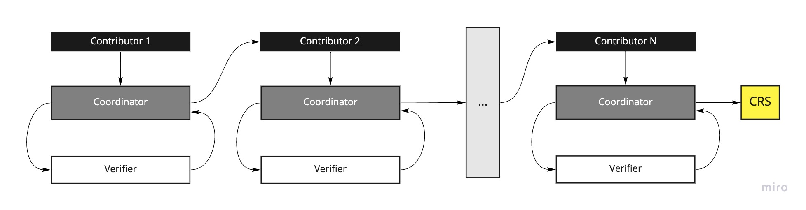
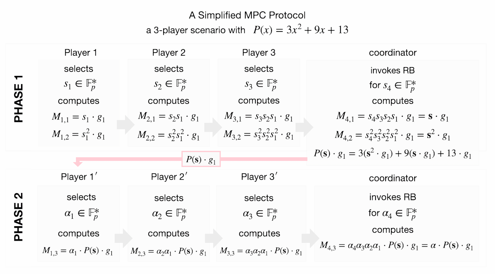
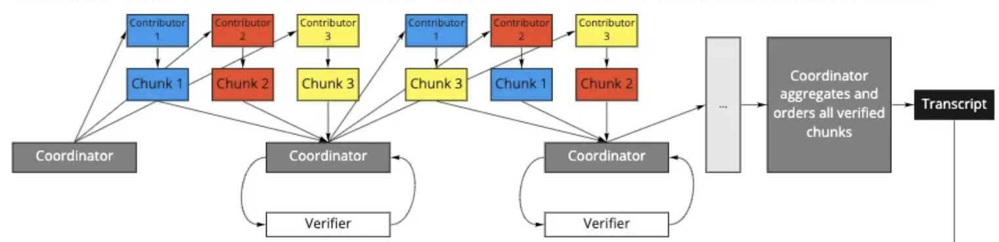
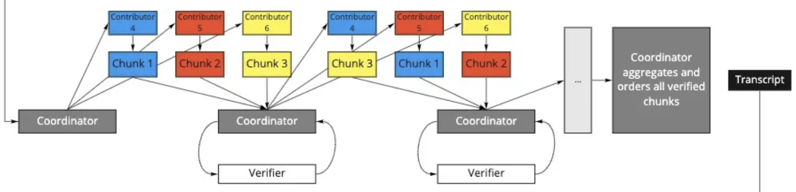
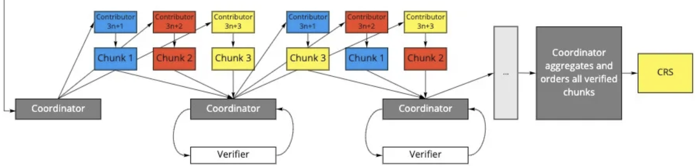

# Setup Ceremonies

https://zkproof.org/2021/06/30/setup-ceremonies

## Introduction

Zero-knowledge proofs (ZKPs) have a particularly important history in the context of cryptocurrencies since Zerocoin and Zerocash. While early implementations focused on enabling general privacy for financial transactions, ZKPs have found increasing applicability outside of mere obfuscation. For example, zkRollups are a technique to increase the scalability of Ethereum by enabling greater transaction throughput. Recursive proof constructions, such as described in Halo, can be used to create succinct blockchains, reducing the burden on light clients. Proposals such as Proof-of-Necessary Work leverage the capabilities of zkSNARKs to provide security at the consensus layer of the network. Finally, constructions such as Zexe enable an entirely new programming model of off-chain computation, on-chain verification upon which new classes of applications can be built not only for the cryptocurrency use cases but the traditional web as well.

## ZKPs are not one-size fits all

We often refer to zero-knowledge proofs monolithically, but there are many different flavors of ZKPs. Strictly speaking, a ZKP scheme provides the property of “zero-knowledge” such that the verifier of a proof learns nothing about the facts underlying the statement being proved. ZKPs can be both interactive and non-interactive, although non-interactive schemes have traditionally garnered more interest. There are several classes of non-interactive ZKPs that fulfill that criteria, including:

- Non-interactive Zero-Knowledge Arguments (NIZKs)
- Succinct Non-interactive Zero-Knowledge Arguments (SNARGs)
- Succinct Non-interactive Zero-Knowledge Arguments of Knowledge (SNARKs or sometimes zkSNARKs)

zkSNARKs have been the most popular for use in cryptocurrencies due to their succinctness and efficiency. The first real-life deployment of a SNARK was the Pinnochio protocol in ZCash Sprout, later replaced by a pairing-based zk-SNARK introduced by Jens Groth in Groth16. Now colloquially referred to as “Groth16,” this construction has become popular in a variety of cryptocurrency applications because of its relatively small proof sizes and constant-time proof verification.

Despite their adoption to date, there are two main critiques of zk-SNARKs.
 
First, constructions such as Groth16 are not universal but fixed to a single NP-relation. In other words, proofs are specific to a given program. Changing the program means starting over, throwing out the old parameters, and generating new ones. Thus, the flexibility of these zkSNARKs is limited.
 
Second, zkSNARKs rely on a common reference string (CRS) as a public parameter for proving & verifying. This CRS must be generated in advance by a trusted party. The information used to create the CRS, called ‘toxic waste’ needs to be destroyed as soon as the CRS is created. Otherwise, it can be used by adversaries to forge fraudulent proofs.
 
Academic research on universal SNARKs (e.g. Marlin, PLONK, etc) has largely addressed the first critique. As for the second, we know of zero-knowledge proof constructions that allow for transparent parameter generation. Bulletproofs and STARKs (Scalable Transparent Arguments of Knowledge) for example do not require any trusted setup. However, while both STARKs and Bulletproofs have great applications, zkSNARKs (and especially non-universal SNARKs like Groth16) have yet to be beaten in terms of practical efficiency. A notable advantage of zkSNARKs is their relatively small proof sizes and constant-time verification. These make them the tool of choice for many blockchain-based applications.

## Securely generating the CRS via MPC

Because of their advantages, zkSNARKs are not going away anytime soon. But the reality is that the security of a system based on zkSNARKs largely boils down to how the CRS was generated. Doing so without compromising the ideals of privacy-preserving blockchain-based systems: (security and decentralization) is very important. The generation of public parameters for zkSNARKs is called the “setup ceremony” because of its importance and (as we will see) the need for multiple independent parties to contribute to the process.
 
So far, the preferred technique for setup ceremonies has been multi-party computation (MPC). Setup ceremony MPC schemes are interactive protocols involving multiple parties who contribute randomness to iteratively construct the CRS. Key to this technique is that all parties need to keep the inputs (their sampled randomness) hidden. In fact, honest participants should delete this “toxic waste,” immediately. Otherwise, a malicious party with knowledge of these inputs could exploit the underlying mathematical structure of the CRS to create unsound proofs.

A typical ceremony consists of $N$ number of players, the coordinator, and the verifier. The MPC protocols are always of a round-robin nature, where a player $P_i$ receives a single message from player $P_{i-1}$. Player $P_i$ adds their input to accumulated randomness before passing it onto Player $P_{i+1}$. In the end, the final result is the CRS. In the intermediate state, as it is being passed between players, the message is referred to as the “transcript.”
 
The first family of MPC protocols for ZKPs was proposed by Ben-Sasson et al. in [BCGTV15]. The authors prove that the CRS generated with these protocols is secure as long as at least one contributing party is honest. Since then, the goal of setup ceremonies has been to maximize the number of honest and independent contributors. If there are many, independent participants, then intuitively the likelihood that all are dishonest is reduced to the point of negligibility.
 
Zcash used the BCGTV scheme to generate the CRS for the first version of ZCash, “Sprout” as described in this post and episode of the U.S. National Public Radio show, Radiolab. Despite its novelty, a drawback of the BCGTV protocol requires that participants be identified in advance. So participation in the ceremony was cumbersome and limited to experts who could be trusted to perform it properly. Because of the limited participation, critics argued that the degree of trust required was still too high and contradicted the ideals of the decentralized system the zkSNARK being set up to secure.
 
The Zcash ceremony demonstrated that successfully running a setup ceremony boils down to the logistics and efficiency of coordinating participants, who ideally are unrelated to one another. This ensures a lower (real and perceived) likelihood that all contributors might maliciously collude. But it can be challenging to coordinate geographically distributed participants who must remain available for the entire duration of the ceremony.

In 2017, Bowe et al. introduced a second family of MPC protocols [BGM17] specifically for pairing-based zk-SNARKs like Groth16. This paper aimed to address some of the drawbacks of prior schemes. In their proposed protocol called MMORPG, a central “coordinator” manages messages between the participants. The CRS is generated in two phases. The first phase referred to as “Powers of Tau”, produces generic setup parameters that can be used for all circuits of the scheme, up to a given size. The second phase converts the output of the Powers of Tau phase into an NP-relation-specific CRS.

The “Powers of Tau” ceremony has several advantages over earlier schemes. First, contributors do not need to be selected in advance. Instead, the protocol uses a random beacon that produces public, random values at set intervals to enable a continuous ceremony. Participants, therefore, do not always need to be available and online. The random beacon also ensures public verifiability of the coordinator. As a result, the protocol can theoretically support hundreds or even thousands of participants.

Since the original publication of the paper, Powers of Tau ceremonies have become the industry standard. Projects such as Filecoin, Ethereum (Semaphore), and Zcash Sapling have used it to generate a CRS for their systems. But how does it work under the hood?

## Powers of Tau, in depth

Pairing-based zk-SNARKs involve a bilinear map $e : \mathbb{G}_1 \times \mathbb{G}_2 \to \mathbb{G}_T$ defined by $e( a \cdot g_1 , b \cdot g_2 ) = {g_T}^{ab}$ where $\mathbb{G}_i$ is a group of order $p$ , and for each $i \in \{ 1, 2, T \}$, $g_i$ is the generator of $G_i$.

In order to appreciate the serialized process of Powers of Tau, as well as to see the cumulative nature of the CRS elements, consider a toy example: a 3-player MPC ceremony for a zk-SNARK where $P(x) = 3x^2 + 9x + 13$ is the polynomial associated with the arithmetic circuit of the NP-relation.

The CRS in this example is a triple $\big( \mathbf{s} \cdot g_1 ,\ \ \mathbf{s}^2 \cdot g_1 ,\ \ \alpha P(\mathbf{s}) \cdot g_1 \big)$, where $\mathbf{s} = s_{N+1} s_N s_{N-1} \cdots s_2 s_1$ and $\mathbf{ \alpha } = \alpha_{N+1} \alpha_N \alpha_{N-1} \cdots \alpha_2 \alpha_1$ are scalar multiples that have been cumulatively computed in a serial manner.
Following the MPC protocol in [BGM17], each player contributes their multiplicative factor to intermediate values of the CRS from previous players, as depicted in Figure 1 below.

The toxic waste in this example is $\{ \mathbf{s} , \mathbf{s}^2 , \alpha \}$. Note that with each successive contribution, the independent randomness chosen by the player accumulates in the transcript. Because we assume discrete log is hard in these groups, it’s infeasible for Player $N$ to “unwind” the transcript to determine any of the prior contributions of Players $0 \dots N-1$. We can observe that the toxic waste in Phase 1 is $\{ \mathbf{s} , \mathbf{s}^2 \}$ because $ deg(P(x)) = 2$. For a general polynomial of degree $n$ , and if the traditional symbol $\tau$ is used instead of $\mathbf{s}$ , the toxic waste in Phase 1 would be $\tau , \tau^2 , \tau^3 , \dots , \tau^n$ and thus the name “powers of tau”.

## Optimistic Pipelining

MMORPG was a step forward in the design of setup ceremonies, enabling greater participation and streamlining the procedure by introducing a coordinator. Yet the serialized nature of the protocol remains a drawback. Even though participants no longer have to be online for the entire ceremony, they can still only participate one at a time. Because the CRS scales linearly with the size of the circuit, individual contributions can take a long time, and as a result, setup ceremonies are less likely to attract participants the longer they go on.

Fortunately, there have been recent proposals on how to improve MMORPG to parallelize the process. For example, Justin Drake of the Ethereum foundation proposed optimistic pipelining. In such a scheme, instead of waiting (on one long queue in order) to contribute to the entire transcript, the CRS is split into smaller segments called rounds to which participants contribute in the normal way (sequentially but waiting in shorter queues) before the round result is submitted to the ‘aggregate’ transcript.

Vitalik Buterin made an observation, in the form of a comment on Justin Drake’s post, that the players’ contributions do not need to be made in the strict order of exponents. The key insight is that contributions can be applied to different parts of the CRS simultaneously, enabling participants to contribute to an MMORPG ceremony in parallel. This significantly reduces end-to-end computation time for the MPC. We describe setups that use this method as “optimistic setups.”
 
Although these schemes might suffer from denial-of-service attacks, in the worst case the coordinator could simply discard the contributions of players from a single round. This is much better than aborting the entire ceremony.
 
Kobi Gurkan proposed an MMORPG MPC variant, where the security of Drake’s optimistic setup is enhanced by splitting verification into the proof-of-knowledge CheckPOK and consistency check. In this case, the verifier runs CheckPOK for every segment but runs the consistency check only once at the end of the ceremony. This results in an optimized and secure MPC for an arithmetic circuit with parameters of any size.

Celo’s recent setup ceremony Plumo used the optimistic MMORPG MPC. Aleo plans to follow suit with its forthcoming setup ceremony. The MMORPG MPC scheme is particularly well suited for systems such as Zexe, as the powers of tau parameters can be used as the system’s general parameters while allowing flexibility with individual applications choosing their specific arithmetic circuit CRS in Phase 2.

## Further Optimization Strategies

Several other strategies have been used to unravel this MPC logistic conundrum. Note that the original MMORPG used a central “coordinator” to manage messages to and from participants, and assembles the transcript. Historically, this role has been performed manually. But by automating the coordinator, the process becomes less logistically intensive AND makes the ceremony more secure by reducing the chance of human error.
 
This is the path teams have followed recently. For example, Celo’s recent Plumo ceremony featured an automated coordinator (see the Espero talk by Kobi Gurkan for more details).

Beyond pure decentralization and security concerns, teams are increasingly viewing these ceremonies as products in their own right. For example, Tornado.cash ran a setup ceremony that enabled users to contribute directly from the web browser, resulting in a record-breaking number of 1114 participants. The success of the Tornado setup shows that, in contrast to prior ceremonies, which were viewed as a necessary evil, modern setup ceremonies that put the user experience ‘front and center’ not only encourage more contributions but can be viewed as products in their own right.

## Conclusion

Though many have argued that the requirement to generate the CRS is a critical flaw for zkSNARKs, one must acknowledge their efficiency advantages over other ZKP schemes. This is why they remain the industry standard, and why so many teams and researchers have evolved and improved these ceremonies to where we are today. And thanks to improvements to the protocol, infrastructure, and UX layers, participation rates have gone up significantly.
 
Whereas the original Zcash ceremony had only six participants, modern ceremonies can theoretically scale to support hundreds or even thousands of participants. And since only a single honest participant is required for the CRS to be secure, more participants generally equals more security, as each independent member who joins makes collusion much more inconceivable. And as academia and industry continue to evolve and refine best practices around setup ceremonies, the challenge of running the MPC protocol to set up parameters for zkSNARKs will only get easier over time.
 
Innovations that are making setup ceremonies more efficient are mirrored in the breathtaking pace of ZKP research. Schemes are becoming more efficient, making applications practical, encouraging further innovation and development. This has led to a “Moore’s Law”-like curve of improvement for ZKPs. Now there are even so-called “transparent” zkSNARKs (such as Fractal and SuperSonic) that remove the requirement for a trusted setup altogether. Despite these innovations, the efficiency of existing zkSNARKs such as Groth16 means that they will likely continue to be applied for years to come. Therefore, setup ceremonies can provide an opportunity for a collaborative community celebration of and for the project that is implementing them. So they represent an opportunity to embrace, rather than a necessary evil to overcome.
